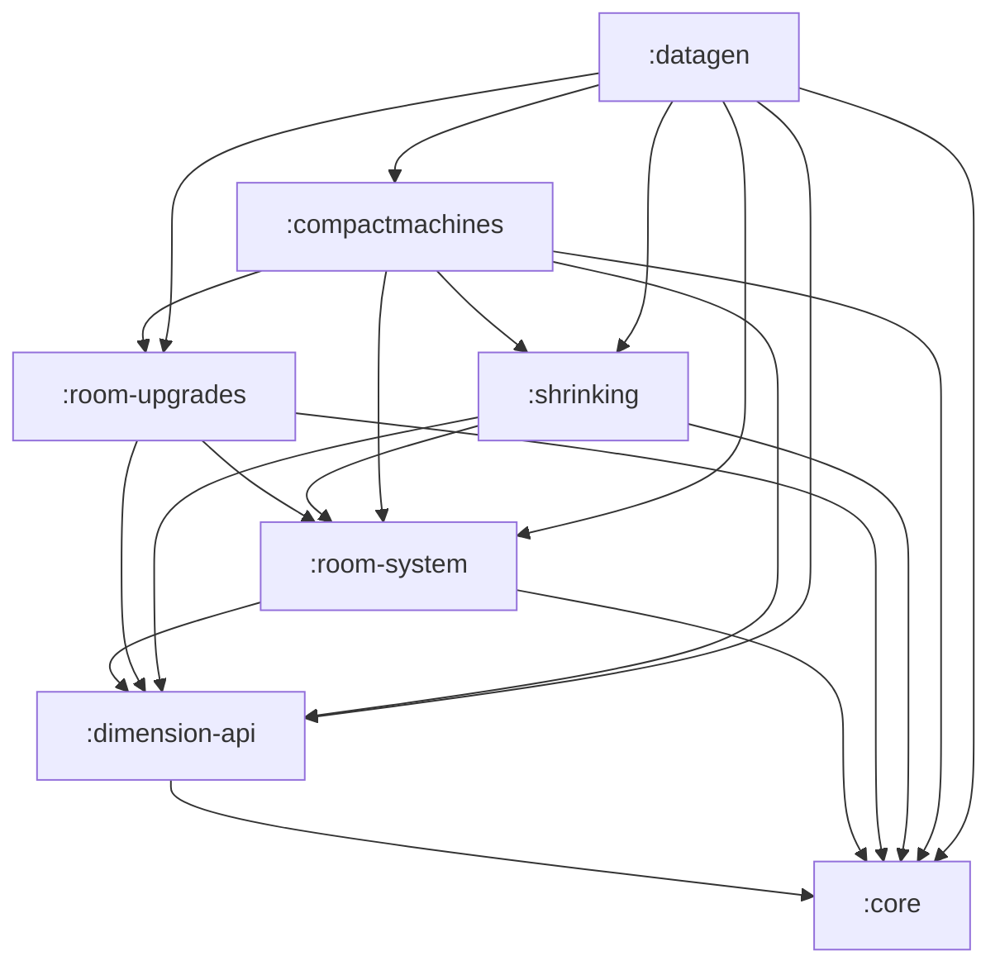
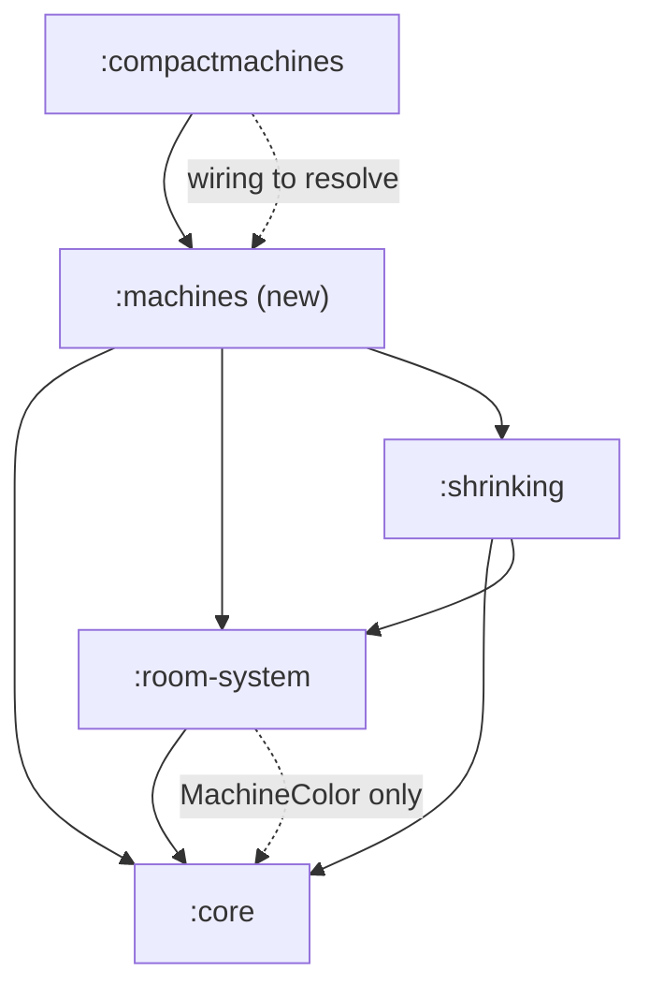

# Project & Source-Set Layout

> **⇢ Active plan:** the per-feature vertical modules are being consolidated into
> **three horizontal projects** — see [Three-project restructure](#planned-three-project-restructure)
> at the bottom. Everything above that section describes the *current* layout.

Working notes for the multi-module Gradle build, kept as a reference while we
plan pulling a dedicated `:machines` project out of `:compactmachines`.

All modules share the Maven group `dev.compactmods.compactmachines` and the Java
package root `dev.compactmods.machines.*`. The namespace is **partitioned across
modules** — each module owns a disjoint slice of the package tree (see
[Namespace ownership](#namespace-ownership)).

Toolchain: Java 25, NeoForge via the `moddev` Gradle plugin. Shared conventions
live in `buildSrc` as the `cm-module-conventions` plugin.

---

## Modules (Gradle subprojects)

Declared in [settings.gradle.kts](settings.gradle.kts):

| Project            | archivesName     | Role                                                            | Java files |
| ------------------ | ---------------- | -------------------------------------------------------------- | ---------: |
| `:core`            | `core`           | Shared base: registries glue, attachment/capability plumbing, interface-injection metadata | 34 |
| `:dimension-api`   | `dimension-api`  | Compact-dimension API surface                                   | 3 |
| `:room-system`     | `rooms`          | Room model, registry, spatial/spawn/template logic (+ `api`)   | 30 (+27 api) |
| `:room-upgrades`   | `room-upgrades`  | Room upgrade tick systems + storage (+ `api`, `storage`)       | 13 (+17 api, +8 storage) |
| `:shrinking`       | `shrinking-api`  | Shrinking-device API + impl (+ `api`)                          | 10 (+7 api) |
| `:machines`        | `machines`       | Machine block/item/BE/UI, registrations, packet, i18n + client rendering (+ `api`) | 25 (+3 api) |
| `:compactmachines` | `compactmachines`| **The mod.** Blocks/items/UI/network/compat/client + wiring    | 95 |
| `:datagen`         | —                | Data-generation runner (not published as a lib)                | 22 |

`:core`, `:dimension-api`, `:room-system`, `:room-upgrades`, `:shrinking` are
published to GitHub Packages and **jar-in-jar bundled** into the
`:compactmachines` artifact. `:datagen` is a build-time-only runner.

---

## Namespace ownership

Every module writes into `dev.compactmods.machines.*`, carved up as:

| Package slice                        | Owning module / source set                     |
| ------------------------------------ | ---------------------------------------------- |
| `.core`                              | `:core` (main) — now only `MachineColor` under `.core.machine` |
| `.api.machine`                       | `:machines` (**api** source set)               |
| `.machine`                           | `:machines` (main) — impl, `.machine.network[.client]`, `.machine.i18n`, `.machine.client[.render/.shader]`, `.machine.util` |
| `.api.dimension`                     | `:dimension-api` (main)                         |
| `.api.room`                          | `:room-system` (**api** source set)            |
| `.room`                              | `:room-system` (main)                          |
| `.upgrades`                          | `:room-upgrades` (api / main / storage)        |
| `.shrinking`                         | `:shrinking` (api + main)                       |
| `.datagen`                           | `:datagen` (main)                               |
| everything else — `.client`, `.command`, `.compat`, `.dimension`, `.feature`, `.gamerule`, `.i18n`, `.incubating`, `.machine`, `.network`, `.player`, `.preview`, `.server`, `.util`, `.villager`, plus top-level `Advancements`, `CMRegistries`, `CMDataAttachments`, `CMDataComponents`, `CompactMachinesCommon` | `:compactmachines` (main) |

> **Note:** there is no `dev.compactmods.machines.api` package in
> `:compactmachines` today. The published API lives in the sibling `*-api`
> modules and in the `api` source sets of `:room-system` / `:room-upgrades` /
> `:shrinking`. The `dev.compactmods.machines.api.CompactMachines` reference in
> [datagen/build.gradle.kts](datagen/build.gradle.kts) comments is stale — no
> such class exists.

The `:compactmachines` main slice is the monolith a future `:machines` project
would carve out of.

---

## Source-set layout

Most library modules apply `cm-module-conventions`, which defines `main` + `test`
(test resources stripped). Several add extra source sets that are **folded back
into `main`** via `srcDir`, so they compile in isolation (own
`api`/`storage` configuration chains) but ship inside the single `main` jar.

| Module            | Source sets                    | Notes |
| ----------------- | ------------------------------ | ----- |
| `:core`           | `main`                         | Declares `neoForge.interfaceInjectionData { from + publish }` on `interfaces.json` |
| `:dimension-api`  | `main`, `test`                 | |
| `:room-system`    | `main`, **`api`**, `test`      | `api` folded into `main`; interface injection consumed from `:core` |
| `:room-upgrades`  | `main`, **`api`**, **`storage`**, `test` | `api` + `storage` folded into `main` |
| `:shrinking`      | `main`, **`api`**, `test`      | `api` folded into `main`; interface injection from `:core` |
| `:machines`       | `main`, **`api`**, `test`      | mirrors `:room-system`; `api` folded into `main`; interface injection from `:core`. Owns its own `DeferredRegister`s, bound via `Machines.init(modBus)` |
| `:compactmachines`| `main`, `test`, `generated`    | `generated` resources merged into main resources; `test` only added to the mod on CI |
| `:datagen`        | `main`                         | |

**`api` source sets are compiled in isolation.** A project consumed from a file
under `src/api/java` must be listed with the qualified config
(`apiCompileOnly(...)`) *in addition to* the plain `compileOnly(...)` for `main`
— the IDE flattens source-set classpaths so unqualified imports look fine in the
editor but fail in `./gradlew compileApiJava` (see the comment in
[room-system/build.gradle.kts](room-system/build.gradle.kts)).

---

## Inter-project dependency graph



Build order (topological): **core → dimension-api → room-system →
{room-upgrades, shrinking} → compactmachines → datagen**.

### Edge detail

| From \ To (config)          | core | dimension-api | room-system | room-upgrades | shrinking | compactmachines |
| --------------------------- | ---- | ------------- | ----------- | ------------- | --------- | --------------- |
| **:dimension-api**          | impl | — | — | — | — | — |
| **:room-system** main       | compileOnly | compileOnly | — | — | — | — |
| **:room-system** api        | apiCompileOnly | apiCompileOnly | — | — | — | — |
| **:room-upgrades** main     | compileOnly | compileOnly | compileOnly | — | — | — |
| **:room-upgrades** api      | apiCompileOnly | — | apiCompileOnly | — | — | — |
| **:room-upgrades** storage  | storageCompileOnly | — | storageCompileOnly | — | — | — |
| **:shrinking** main         | compileOnly | compileOnly | compileOnly | — | — | — |
| **:shrinking** api          | apiCompileOnly | apiCompileOnly | apiCompileOnly | — | — | — |
| **:compactmachines** main   | impl + jarJar | impl + jarJar | impl + jarJar | impl + jarJar | impl + jarJar | — |
| **:datagen** main           | compileOnly | compileOnly | compileOnly | compileOnly | compileOnly | impl |

Observations:
- The library modules depend on each other **`compileOnly`** — they expect the
  API/impl to be present at runtime (provided by `:compactmachines`'s jar-in-jar
  bundle), not to bundle it themselves.
- `:compactmachines` is the only module that pulls the libs as
  **`implementation` + `jarJar`**, i.e. it is the assembly point.
- `:datagen` mirrors `:compactmachines`'s dependency set but as `compileOnly`,
  plus `implementation(:compactmachines)` to drive generation.

---

## External dependencies

| Module            | Library (config)                                                            |
| ----------------- | -------------------------------------------------------------------------- |
| `:core`           | NeoForge (moddev) only                                                       |
| `:room-system`    | `jnanoid` (impl), `feather` (impl), `spatial` (impl)                         |
| `:room-upgrades`  | `spatial` (compileOnly)                                                      |
| `:shrinking`      | `feather` (compileOnly)                                                      |
| `:compactmachines`| `jnanoid` (impl + jarJar); `feather`, `spatial` (compileOnly + jarJar non-transitive); `jei`, `jade` (compileOnly). KubeJS/Rhino/Curios/Gander wired but currently commented out |

Version catalogs (in [gradle/](gradle/)): `neoforged`, `mojang`, `compactmods`,
`mods`.

---

## Cross-cutting mechanisms

- **Interface injection** — `:core` owns
  [core/interfaces.json](core/interfaces.json) and both `from(...)`s it (own
  classpath) and `publish(...)`es it (Maven consumers resolve it transitively).
  In-source siblings can't rely on moddev's auto-propagation across project
  deps, so `:compactmachines`, `:room-system`, and `:shrinking` each re-declare
  `interfaceInjectionData { from(core.file("interfaces.json")) }`.
- **`FMLModType = GAMELIBRARY`** — `cm-module-conventions` stamps every library
  jar so its classes load on NeoForge's transformer classloader (avoids
  `LinkageError` for classes referencing game types like `MinecraftServer`).
- **Automatic-Module-Name** — set per module (`compactmachines.core`,
  `compactmachines.rooms`, `compactmachines.room.upgrades`,
  `compactmachines.api.dimension`, `compactmachines.api.shrinking`) so the
  jar-in-jar copy and the direct project-dep copy dedupe under `JarSelector`.

---

## Extraction: the `:machines` project (in progress)

Goal: pull `machines.machine` (impl, currently in `:compactmachines`) and the
related `machines.core.machine` (in `:core`) into a dedicated `:machines`
project structured like `:room-system` (an `api` source set folded into `main`).

### Status

- ✅ **Phase 1 — scaffold + API surface (done, compiles).** Created `:machines`
  with `api` + `main` source sets ([machines/build.gradle.kts](machines/build.gradle.kts),
  registered in [settings.gradle.kts](settings.gradle.kts)). Moved the three
  api-surface types out of `:core`'s `core.machine` into the `:machines` **api**
  source set, renamed to `dev.compactmods.machines.api.machine[.block]`:
  - `MachineConstants`
  - `block.ICompactMachineBlockEntity`
  - `block.IBoundCompactMachineBlockEntity`

  `MachineColor` stays in `core.machine` (leaves `:room-system`'s only
  cross-reference intact — no cycle). All importers in `:compactmachines` and
  `:datagen` updated; both now depend on `:machines` (`:compactmachines` via
  `implementation` + `jarJar`, `:datagen` via `compileOnly`).
- ✅ **Phase 2 — move the impl (done, compiles).** All six impl files
  (`Machines`, `block/*`, `item/*`, `ui/*`, `capability/*`) moved to `:machines`
  main, keeping their FQCN `dev.compactmods.machines.machine.*` (so their ~17
  importers were untouched). The sibling back-references were resolved by the
  **"machine owns its registrations"** approach — see below.

### How the Phase 2 cycle was resolved

The impl files reached back into `:compactmachines` aggregators. Rather than
depend upward, `:machines` now **owns** that content, following the
`:shrinking` template (its own `DeferredRegister`s + `Machines.init(modBus)`,
called from `CompactMachinesCommon`):

| Was in `:compactmachines`                    | Now in `:machines`                                   |
| -------------------------------------------- | ---------------------------------------------------- |
| `CMRegistries.{BLOCKS,ITEMS,BLOCK_ENTITIES,MENUS}` (machine entries) | `Machines.{BLOCKS,ITEMS,BLOCK_ENTITIES,MENUS}` — own registers |
| `CMDataComponents.MACHINE_COLOR`             | `Machines.DataComponents.MACHINE_COLOR`              |
| `CMDataAttachments.OPEN_MACHINE_POS`         | `Machines.Attachments.OPEN_MACHINE_POS`             |
| `network.machine.MachineColorSyncPacket`     | `machine.network.MachineColorSyncPacket`            |
| `client.machine.ClientMachinePacketHandler#setMachineColor` | `machine.network.client.ClientMachinePacketHandler` |
| `i18n.MachineTranslations`                   | `machine.i18n.MachineTranslations`                  |

`CMRegistries` lost `BLOCK_ENTITIES` and `MENUS` entirely (machine was their
only user); `BLOCKS`/`ITEMS` stay (villager, dimension still use them).
`CMDataComponents` keeps `PRIDE_FLAG`/`UPGRADE_INSTANCE_ID`; `CMDataAttachments`
keeps `MACHINE_SHADER`. Registry **names** were preserved (`machine`,
`machine_color`, `open_machine`, …) so no resource/datagen output changed.
Consumers of the relocated symbols (JEI is commented out; `client.machine`,
`command`, `datagen`) were repointed. `CMNetworks` still registers the packet
(it depends on `:machines`).

`MachineColor` remains in `:core`'s `core.machine` (only `MachineColor.java`
lives there now), keeping `:room-system`'s lone cross-reference cycle-free.

- ✅ **Phase 3 — client rendering (done, compiles).** The `client.machine.*`
  package moved into `:machines` as `machine.client.*` (renderers, shaders,
  `FlagShader`, `MachineColors`, `MachineUI`, `MachinesClient`). Renamed to a
  machine-owned namespace to avoid splitting `dev.compactmods.machines.client`
  across two jars. Client code in a library module follows the `:shrinking`
  precedent (`shrinking.network.client`). Alongside it:
  - `PRIDE_FLAG` data component moved `CMDataComponents` → `Machines.DataComponents`
    (machine-render-only). `CMDataComponents` now holds just `UPGRADE_INSTANCE_ID`.
  - `util.SlotRangeUtil` moved to `machine.util` (its only other user, in
    `:room-upgrades`, was commented out).
  - **`ClientConfig` stays in `:compactmachines`** (mod-wide client config,
    also holds the room-preview toggle). The two machine settings it defines
    (`enablePride`, `defaultPrideShader`) are handed to a
    `machine.client.MachineClientConfig` holder that `ClientConfig` populates
    after building the spec — so `:machines` reads them without depending
    upward, and **the user-facing config file is unchanged**.
    *(Alternative not taken: give `:machines` its own config file. Say the word
    and I'll switch to that.)*
  - **`client.machine.ClientMachinePacketHandler` stays** in `:compactmachines`
    — after Phase 2 it only opens the room-preview screen, a preview/room
    feature coupled to `client.room` + `client.config`.
  - `compat.MachineOverview` (an unused machine-domain record, misfiled under
    `compat`) moved to `dev.compactmods.machines.machine.MachineOverview`.
    **Note: it has no callers — a deletion candidate.**

### What deliberately stays in `:compactmachines`

With the machine vertical slice extracted, the remaining "machine"-named code is
*not* machine-scoped and belongs elsewhere:

| Code                                          | Why it stays |
| --------------------------------------------- | ------------ |
| `network.machine.OpenMachinePreviewScreenPacket` + `client.machine.ClientMachinePacketHandler` | Part of the **room-preview** feature (`preview/*`, `client.room.MachineRoomScreen`); would go to a future `:preview` module, not `:machines` |
| `client.creative.CreativeTabs`                | Cross-cutting — aggregates items from `:machines`, `:room-system`, `:shrinking` |
| `CMRegistries`, `CMNetworks`, `Commands`, `Advancements`, `CreativeTabs` | Mod-wide assembly/glue |
| `compat.jei/jade/curios`                       | Mod-level third-party integration (jade/jei machine providers are currently commented out) |
| `command.rooms.CMFindRoomSubcommand`           | A **room** command that merely inspects a machine block |
| `server.ServerCapabilities`, `Advancements`    | Room/mod-wide, not machine-specific |

The `:machines` module is now a complete vertical slice: API, impl,
registrations, networking, i18n, and client rendering.

---

## (Original analysis) extraction feasibility

Candidate contents: `machines.machine` (currently in `:compactmachines`) plus
the related `machines.core.machine` (in `:core`).

### `machines.machine` — in `:compactmachines` main (6 files)

```
machine/Machines.java
machine/ui/MachineUIMenu.java
machine/capability/MachineCapability.java
machine/item/BoundCompactMachineItem.java
machine/block/CompactMachineBlock.java
machine/block/CompactMachineBlockEntity.java
```

**Inbound (who depends on it):** only `:compactmachines` itself (12 files) and
`:datagen` (5 files). **No library module depends on it** — it sits at the top
of the stack. The `:compactmachines` importers cluster in `client/machine*` (6),
`preview/client` (2), `command/rooms`, `client/room`, `client/creative`.
`Machines` (the `DeferredRegister` holder) is the most-referenced symbol.

**Outbound (what it needs):**

| Target module        | What `machines.machine` pulls in |
| -------------------- | -------------------------------- |
| `:core`              | `core.machine.*` (MachineColor, MachineConstants, `ICompactMachineBlockEntity`, `IBoundCompactMachineBlockEntity`), `core.CompactMachinesCore` |
| `:room-system`       | `room.Rooms`, `api.room.template.{RoomTemplate,RoomTemplateHelper}`, `api.room.RoomInstance`, `api.room.capability.RoomCapabilities`, `api.room.generation.RoomGenerationException` |
| `:shrinking`         | `shrinking.{Shrinking,ShrinkingHelper}`, `shrinking.api.ShrinkingDeviceConfiguration`, `shrinking.history.UsedShrinkingDeviceOnMachine` |
| `:compactmachines` (siblings) | `CMRegistries`, `CMDataComponents`, `CMDataAttachments`, `network.machine.MachineColorSyncPacket`, `i18n.MachineTranslations` |

The library-module deps (core / room-system / shrinking) map cleanly onto a
`:machines` project sitting **above** those three. The awkward part is the
**back-references into `:compactmachines` siblings** — `CMRegistries`,
`CMDataComponents`, `CMDataAttachments`, `network.machine`, and `i18n`. Those are
mod-wiring; extracting `machines.machine` means either moving that wiring down
with it, inverting it (register from the mod, inject into `:machines`), or
splitting those aggregator classes.

### `machines.core.machine` — in `:core` main (4 files)

```
core/machine/MachineColor.java
core/machine/MachineConstants.java
core/machine/block/ICompactMachineBlockEntity.java
core/machine/block/IBoundCompactMachineBlockEntity.java
```

**Outbound:** self-contained within `:core` (only `core.util.KeyHelper`,
`core.CompactMachinesCore`).

**Inbound (who depends on it):** `:compactmachines`, `:datagen`, **and
`:room-system`**.

> ⚠️ **Cycle risk.** `:room-system` depends on `core.machine` — but only on
> **`MachineColor`**, and only in three files
> (`api/room/template/RoomTemplate`, `api/room/template/RoomTemplateBuilder`,
> `room/generation/ServerNewRoomBuilder`). Since a `:machines` project would
> depend on `:room-system`, moving all of `core.machine` up into `:machines`
> would create `room-system → machines → room-system` — a build cycle.
>
> Options: (a) leave `core.machine` in `:core`; (b) move only the
> block-entity interfaces to `:machines` and keep `MachineColor` /
> `MachineConstants` in `:core`; or (c) relocate `MachineColor` so `:room-system`
> no longer reaches into a machine package at all.

### Sketch of the resulting position



`:machines` slots between the API/system libraries and the mod. The two things
that must be resolved first: the `MachineColor` cycle from `:room-system`, and
the sibling-wiring back-references (`CM*` aggregators, `network.machine`,
`i18n`).

---

# PLANNED: three-project restructure

**Motivation:** the codebase has outgrown per-feature *vertical* modules
(`:machines`, `:room-system`, `:shrinking`, … each shipping its own api+impl).
We are switching to three *horizontal* projects, split by role.

## Target: three Gradle subprojects, each with source sets folded into `main`

```
:api        — public API surfaces only (no impl)
   base*    — shared primitives the API needs (see "core decision" below)
   dimension, machines, rooms, roomUpgrades, shrinking
:neoforge   — the NeoForge implementation + the @Mod assembly
   core, machines, rooms, roomUpgrades, shrinking, datagen
   + one source set per cross-cutting concern:
     client, network, command, preview, villager, gamerule,
     dimension, server, feature, i18n, util
   + main/java — @Mod entrypoint & assembly (CompactMachinesCommon,
     CMRegistries, CMDataComponents, CMDataAttachments, Advancements)
:compat     — external-mod integration
   jei, jade, theoneprobe (new), curios
```

Each nested item is a **source set** compiled in isolation (its own
`<name>CompileOnly` chain) and `srcDir`-folded into `main`, exactly as
`:room-system` does today with `api`. One published jar per project.

**Project dependencies:** `:api` ← nothing internal · `:neoforge` → `:api` ·
`:compat` → `:api` + `:neoforge`. No cycles at the project level; source-set
isolation enforces the finer boundaries inside `:neoforge`.

## ⚠️ Open decision: the `core` package (blocks sequencing)

The `:api` source sets depend on 5 types currently in `:core`:

| Type | api-layer uses | repo-wide importers |
| --- | --- | --- |
| `core.CompactMachinesCore` (MOD_ID + `identifier()`) | 9 | **95** |
| `core.data.Saveable` | 4 | 8 |
| `core.machine.MachineColor` | 3 | 11 |
| `core.capability.ServerCapability` | 1 | 3 |
| `core.util.KeyHelper` | 1 | 2 |

All 5 are api-safe (only vanilla/NeoForge deps). But the outline puts `core`
**under `:neoforge`**, and `:api` cannot depend on `:neoforge`. A Java package
also cannot be split across two jars (automatic-module rule). So one of:

- **A — `core` → `:api` in full.** Move the whole `core` package (incl. mixin,
  interface-injection holders) into `:api`. Zero FQCN churn. Deviates from
  "core under neoforge" (core becomes the API foundation instead).
- **B — extract the 5 types to `:api`, rest of `core` stays in `:neoforge`.**
  Honors the outline, but the 5 types get new packages (e.g.
  `api.base.*`) → **~119 import rewrites** (95 for `CompactMachinesCore` alone),
  all mechanical.
- **C — keep `:core` as a 4th shared foundation** below `:api`/`:neoforge`.
  Zero churn, no split, but that's four projects, not three.

*Recommendation: **A*** — least churn while keeping three projects; `core` is in
practice the API's foundation, so housing it with `:api` is coherent. (If "core
must live under neoforge" is firm, **C** is the next-least-disruptive.)

## Current → target mapping

| Current | → Target project / source set |
| --- | --- |
| `dimension-api` (`api.dimension`) | `:api` / `dimension` |
| `machines/src/api` (`api.machine`) | `:api` / `machines` |
| `room-system/src/api` (`api.room`) | `:api` / `rooms` |
| `room-upgrades/src/api` (`upgrades.api`) | `:api` / `roomUpgrades` |
| `shrinking/src/api` (`shrinking.api`) | `:api` / `shrinking` |
| `core` (api-safe subset, per decision) | `:api` / `base` *(or all of core → :api under option A)* |
| `core` (mixin, attachment/capability injection, location, data utils, GameRulesHelper, WallConstants, Translations) | `:neoforge` / `core` |
| `machines/src/main` (impl + `machine.client`) | `:neoforge` / `machines` |
| `room-system/src/main` (`room.*`) | `:neoforge` / `rooms` |
| `room-upgrades/src/main` + `storage` | `:neoforge` / `roomUpgrades` |
| `shrinking/src/main` | `:neoforge` / `shrinking` |
| `datagen` | `:neoforge` / `datagen` |
| `compactmachines`: `command`, `villager`, `gamerule`, `dimension`, `server`, `feature`, `i18n`, `util` | `:neoforge` / one source set each (acyclic) |
| `compactmachines`: `network`, `preview`, `client` | **distributed into feature source sets** (see below) — these are not standalone concerns; `client`/`network`/`preview` were mutually circular |
| `compactmachines`: `@Mod` + `CMData*` + `Advancements` + `incubating` | `:neoforge` / `main` |

### Finalized `network` / `preview` / `client` distribution

The `client`/`network`/`preview` packages formed a dependency cycle
(`client↔network↔preview`). Resolution: they are **feature code grouped by
technical layer**, so each class moves to the source set of the feature it
serves.

| Classes | → source set |
| --- | --- |
| all `preview/**` (11), all `client/room/**` (5), `client/keybinds/room/RoomExitKeyMapping`, `network/room/**` except upgrade packet (8) | `rooms` |
| `network/machine/OpenMachinePreviewScreenPacket`, `client/machine/ClientMachinePacketHandler` | `machines` |
| `client/command/**` (2) | `command` |
| `PlayerRequestedUpgradeUIPacket`, `RoomUpgradeUIMapping`, `upgrades/ui/RoomUpgrade{Menu,Screen}` + registration | ✅ **DELETED** — dead feature, removed |

**Aggregators split per feature** (not kept central): `CMNetworks`,
`CompactMachinesClient`, `ClientConfig`, `CreativeTabs` are decomposed so each
feature registers its own packets / client events / config / creative-tab
entries (the `Shrinking.init` pattern), rather than one mod-wide registrar.
| `compactmachines`: `compat/jei` | `:compat` / `jei` |
| `compactmachines`: `compat/jade` | `:compat` / `jade` |
| `compactmachines`: `compat/curios` | `:compat` / `curios` |
| *(new)* TheOneProbe | `:compat` / `theoneprobe` |
| `compactmachines`: `compat/InterModCompat` | `:neoforge` / `main` (compat enqueue is loader glue) |

FQCN policy: impl packages keep their names (e.g. `dev.compactmods.machines.room.*`
stays), so most consumer imports are untouched — the churn is build files +
`git mv`s + (under option B) the core-type rename.

## Phased sequence (each phase must compile)

1. ✅ **`:api` (done, build green).** `:core` renamed to `:api`; `core.*` +
   all five API surfaces consolidated as isolated source sets (`core`,
   `dimension`, `machines`, `rooms`, `roomUpgrades`, `shrinking`) folded into
   `main`. `:dimension-api` deleted. Interface-injection `interfaces.json` +
   `compactmachines.mixins.json` moved with `core`. Every consumer repointed
   `:core`/`:dimension-api` → `:api`; the library modules dropped their own
   `api` source sets. Full `compileJava` passes.
2. ✅ **`:neoforge` rename + feature absorption (done, build green).**
   `:compactmachines` → `:neoforge`; `machines`/`rooms`/`shrinking`/
   `roomUpgrades`/`storage` impl absorbed as isolated source sets folded into
   `main`; `:room-system`/`:room-upgrades`/`:shrinking`/`:machines` deleted.
   **Now 3 Gradle projects: `:api`, `:neoforge`, `:datagen`.**
3. ✅ **`:datagen` folded in (done, build green).** Absorbed as a `datagen`
   source set in `:neoforge` (NOT folded into `main` — generators don't ship);
   the `data` run moved into `:neoforge`'s runs block (`loadedMods(cmMain)` +
   `sourceSet=datagen`). `:datagen` module deleted.
4. ✅ **`:compat` extracted (done, build green).** `compat/jei|jade|curios`
   moved out of `:neoforge` into the new `:compat` project (source sets
   `jei, jade, curios, theoneprobe` folded into `main`). `InterModCompat` stays
   in `:neoforge` (loader glue). All four plugins are dormant stubs, so `:compat`
   is not yet jarJar-bundled into the mod (would need a neoforge↔compat cycle
   resolved when a plugin is reactivated). **Target reached: 3 projects —
   `:api`, `:neoforge`, `:compat`.**

### Remaining (internal to `:neoforge`, no project-count change)

5. **Aggregator split** (in progress) — ✅ registry aggregators for the
   register-owning concerns done: `gamerule` (own `GAME_RULES`), `villager`
   (own `BLOCKS`/`ITEMS`/`POINTS_OF_INTEREST` + `VILLAGERS`), `dimension` (own
   `BLOCKS`) now self-register via `init(modBus)`; removed from `CMRegistries`,
   which is down to `TABS` + `DATA_COMPONENTS` (only the unused
   `UPGRADE_INSTANCE_ID`) + `FLAG_SHADERS` + the `RoomTemplate`/`FlagShader`
   datapack registries. Dead registers (`CONTAINERS`, `COMMAND_ARGUMENT_TYPES`)
   dropped. ⏳ remaining: `CMNetworks` (per-feature packet registration),
   `CompactMachinesClient`, `CreativeTabs`, and the leftover dead members
   (`UPGRADE_INSTANCE_ID` → `roomUpgrades`, `MACHINE_SHADER` → `machines`).
6. **Glue source sets** (in progress) — ✅ `gamerule, villager, feature, i18n`
   carved into isolated source sets. ✅ **Commands distributed**: single-feature
   subcommands moved into their features and self-exposed — `rooms`
   (`CMRoomCoreSubcommand`, `SpawnSubcommand`, `EnableBasicTemplatesSubcommand`,
   `GenerateRoomCommand`, `Suggestors`), `shrinking` (`CMTeleportSubcommand`,
   `CMEjectSubcommand`), `roomUpgrades` (`RoomUpgradeArgument`); the assembler
   `Commands` + the cross-feature `CMRoomsSubcommand`/`CMFindRoomSubcommand`
   (they touch machine impl) stay in `main`, which pulls everything in
   (main→feature is acceptable — no perfect isolation intended). `Commands.java`
   unchanged (main folds all source sets, FQCNs stable).
   ✅ `util` handled; ✅ `dimension` carved (self-registers `BLOCKS`; deps
   `:api` + `gamerule` + `shrinking`). `server` stays in `main` (too small to
   warrant its own feature yet).
   ⏳ **network/preview/client cluster** (in progress) — placement scheme:
   highest feature each class touches (`rooms ← shrinking ← machines`, so
   cross-feature code lands in the higher feature; no cycles). ✅ pure-room
   subset moved to `rooms`: 5 room packets, the whole preview pipeline
   (`preview/*`, `preview/server`, `preview/client/*` minus the two
   machine-impl ones), `RoomKeyMappings`; added `RoomNetworking` handler
   (`CMNetworks` now delegates room packets to it). ✅ **shrinking stragglers moved**: `PlayerRequestedLeavePacket`,
   `PlayerRequestedTeleportPacket`, `MachineRoomScreen`, `ClientRoomPacketHandler`,
   `RoomExitKeyMapping` → `shrinking`; added `ShrinkingNetworking` handler
   (teleport/leave + the existing `SyncRoomMetadataPacket`); added
   `RoomClientConfig` holder (`ENABLE_ROOM_PREVIEWS`, populated by `ClientConfig`)
   and repointed `MachineRoomScreen` to it. `CMNetworks` now delegates to
   `RoomNetworking` + `ShrinkingNetworking` (only machine packets left direct).
   ⏳ remaining → `machines`: `OpenMachinePreviewScreenPacket`,
   `RoomPreviewRenderer`, `RoomPreviewClient`, `RoomClientEvents` (split:
   machine-menu reg → `MachinesClient`), `ClientMachinePacketHandler`; add
   `MachineNetworking`; `ClientMachinePacketHandler` needs `RoomClientConfig`.
   `RoomsClient`/`CMNetworks`/`ClientConfig`/`CreativeTabs` stay in `main`.
7. ⏳ **Verify** — full `compileJava` (green now) + a `data`/gametest run.

This is a whole-codebase change; it should land phase-by-phase with a green build
at each checkpoint, not in one commit.
