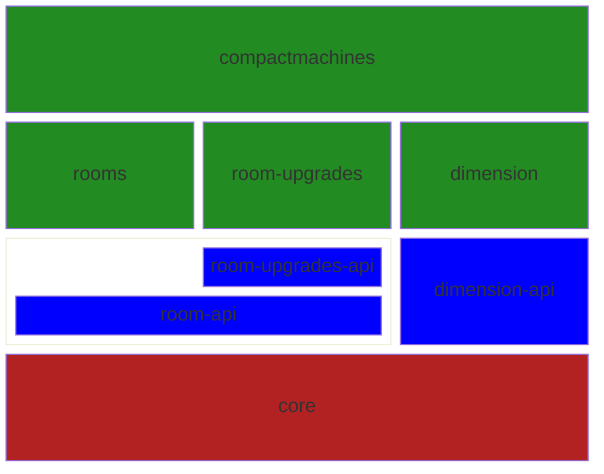

A Minecraft mod that adds one simple game mechanic: small rooms inside of blocks. You can grab the latest build off 
[Curseforge] or on [Github Releases].

| Status | Loader | Version | Minecraft Version | First Released |   Support End |
|:------:|:------:|:-------:|:------------------|---------------:|--------------:|
|   🟨   |   🦊   | **9.x** | 26.2              |            --- |             - |
|   🟦   |   🦊   |   8.x   | 1.21.8            | September 2025 |    April 2026 |
|   🟩   |   🦊   |   7.0   | 1.21.1            |  November 2024 | February 2026 |
|   🟦   |   🔥   |   6.0   | 1.20.1            |  November 2024 | February 2026 |

**Color Meanings/Legend**

|    | Status             | Meaning                                                                                     |
|:--:|--------------------|---------------------------------------------------------------------------------------------|
| 🟧 | Unstable           | Porting to this version has started; critical issues are preventing release.                |
| 🟨 | WIP (Unreleased)   | Currently porting to this version; most major issues are solved. Internal testing required. |
| 🟩 | Stable (Available) | Port has completed and versions are publically available.                                   |
| 🟦 | End of Life (EOL)  | This version is in maintenance; only critical bugfixes will be made.                        |

🦊 - NeoForge; 🔥 - Forge

\* *Note - only the most recent versions are shown here for brevity. For older versions, see [Older Versions](OLDER_VERSIONS.md).* 

Standard support policy is after a new version is released for the current Minecraft version, support for the previous 
version is dropped. If a new major Minecraft version is released and CM is updated, support for the previous major 
version is currently ***45*** days.

​

# Contributing

## Prerequisite: Github Packages
First of all, thank you for wanting to help! To get started, you will need to set up authentication for Github Packages. 
Github has a guide for [how to set up authentication](https://docs.github.com/en/packages/working-with-a-github-packages-registry/working-with-the-gradle-registry#authenticating-to-github-packages).

It is recommended to create a `gradle.properties` file in your user-level gradle folder to simplify working across 
multiple repositories.

## Project Layout
Compact Machines is split into multiple projects to make updating and version maintenance easier. 
The following is a quick summary of each module's purpose:

|              Module | Type     | Description                                                                       |
|--------------------:|----------|-----------------------------------------------------------------------------------|
|     compactmachines | Mod      | Contains the main mod code loaded by the NeoForge mod loader.                     |
|                     |          |                                                                                   |
| compactmachines-api | API      | Contains a few utility classes and wraps the other API projects for ease of use.  |
|            room-api | API      | API classes for dealing with the room system.                                     |
|   room-upgrades-api | API      | API classes for dealing with room upgrades. Implies `room-api`.                   |
|                     |          |                                                                                   |
|                core | Internal | Common functionality for the APIs and projects. Not intended to be used directly. |
|             datagen | Internal | Contains data generators for worldgen/recipes/templates/etc.                      |
|       room-upgrades | Internal | Implementation details for the room upgrade system.                               |

## External Libraries

|   Library | Description                              |
|----------:|------------------------------------------|
| [spatial] | A block-based spatial and maths library. |
| [feather] | A node system built for Java.            |

---

[Curseforge]: https://www.curseforge.com/minecraft/mc-mods/compact-machines
[Github Releases]: https://github.com/CompactMods/CompactMachines/releases

[spatial]: https://github.com/CompactMods/spatial
[feather]: https://github.com/CompactMods/feather